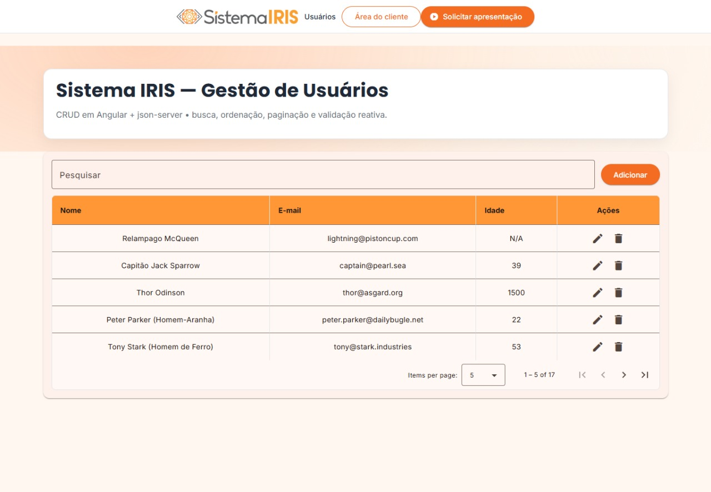
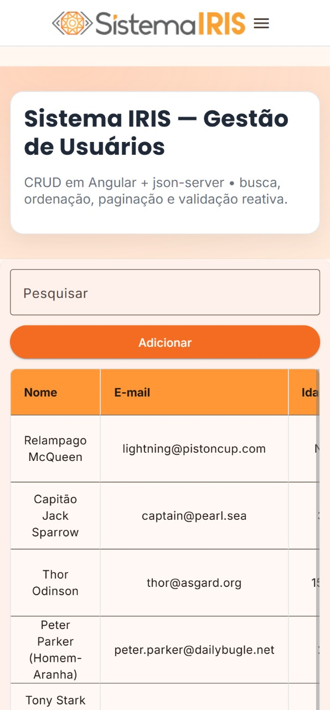
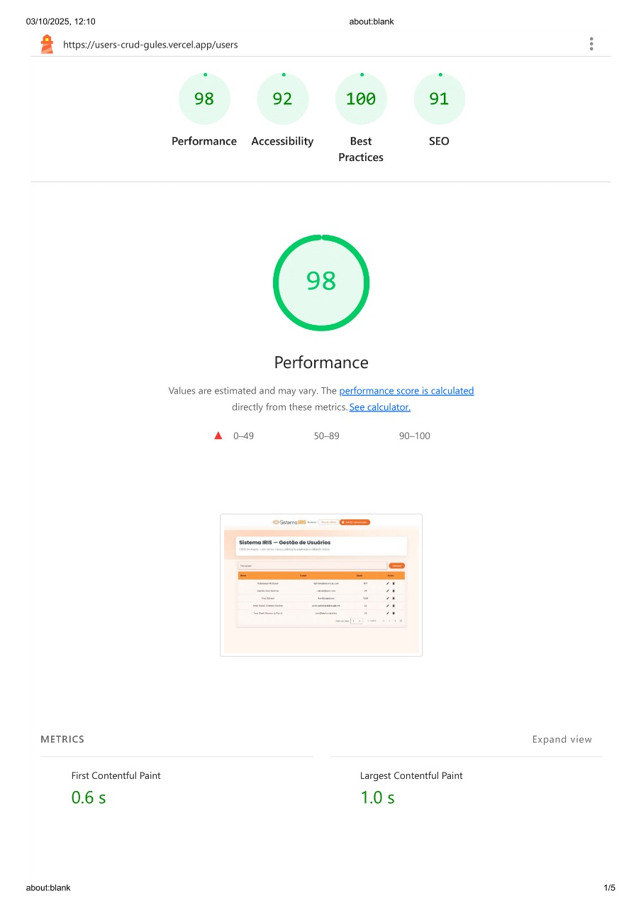
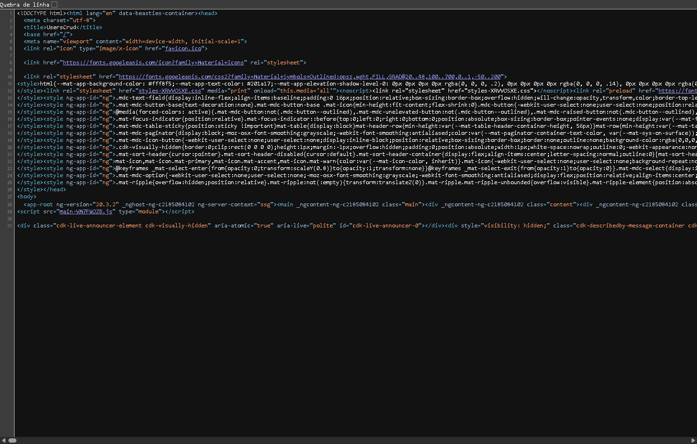

Você está certo: pelos trechos que você me enviou (`users-list.component.spec.ts`, `app.config.ts`, `main.ts`) **não há uso da Signals API** (`signal`, `computed`, `effect`). Então vou **remover qualquer menção a Signals** do README e te entregar o arquivo completo já pronto, usando os nomes de imagens combinados.

Aqui vai o **README.md** final (cole no GitHub):

````md
# 🎯 Sistema IRIS - Gestão de Usuários

Aplicação **Angular 20** completa para gerenciamento de usuários (CRUD), desenvolvida como parte do desafio técnico para **Desenvolvedor Front-End Angular**.

[](https://users-crud-gules.vercel.app/users)
[](.github/workflows/ci.yml)


 <!-- TODO: atualize após rodar coverage -->


---

## 🔗 Links

- **Produção:** https://users-crud-gules.vercel.app/users  
- **Repositório:** https://github.com/Lucas-Christen/users-crud

**Atalhos para o código (diretórios principais):**
- `src/` → https://github.com/Lucas-Christen/users-crud/tree/master/src  
- `src/app/` → https://github.com/Lucas-Christen/users-crud/tree/master/src/app  
- `core/guards` → https://github.com/Lucas-Christen/users-crud/tree/master/src/app/core/guards  
- `core/interceptors` → https://github.com/Lucas-Christen/users-crud/tree/master/src/app/core/interceptors  
- `core/models` → https://github.com/Lucas-Christen/users-crud/tree/master/src/app/core/models  
- `core/services` → https://github.com/Lucas-Christen/users-crud/tree/master/src/app/core/services  
- `features/users/user-form` → https://github.com/Lucas-Christen/users-crud/tree/master/src/app/features/users/user-form  
- `features/users/users-list` → https://github.com/Lucas-Christen/users-crud/tree/master/src/app/features/users/users-list  
- `shared/layout` → https://github.com/Lucas-Christen/users-crud/tree/master/src/app/shared/layout  
- `shared/components/confirm-dialog` → https://github.com/Lucas-Christen/users-crud/tree/master/src/app/shared/components/confirm-dialog  

---

## 👀 Preview Rápido (Evidências)

| Desktop | Mobile | Lighthouse (scores) |
|---|---|---|
|  |  |  |


## ✅ Requisitos Implementados

### 1) Listagem de Usuários
- Tabela responsiva (**Nome**, **E-mail**, **Idade**, **Ações**).
- **Edição inline** (formulário na própria linha).
- **Exclusão** com modal de confirmação.
- **Busca** por nome, e-mail ou idade.
- **Paginação** (5/10/20) e **ordenação** por colunas.

### 2) Formulário de Adição/Edição
- **Reactive Forms** com validações em tempo real.
- **Nome** obrigatório (mín. 3).
- **E-mail** obrigatório (formato válido).
- **Idade** opcional (≥ 18).
- Mensagens de erro contextuais + **Salvar desabilitado** quando inválido.
- Mesmo formulário para criar/editar.

### 3) API REST
- **GET** `/users` — lista todos.
- **POST** `/users` — cria.
- **PUT** `/users/:id` — atualiza.
- **DELETE** `/users/:id` — remove.
- HTTP centralizado em **`UsersService`**.
- Integração com **MockAPI** em produção.

### 4) Validações
- Mensagens claras por tipo de erro.
- Campos marcados como *touched* ao submeter inválido.
- Feedback visual imediato.

### 5) Organização & Boas Práticas
- Serviço dedicado (`UsersService`) e **arquitetura modular** (Core/Features/Shared).
- **Componentes standalone** (Angular 20).
- **SCSS** organizado + Angular Material.

---

## 🔬 Evidências Técnicas (comprovadas no código)

### Zoneless Change Detection (✅)
Habilitado globalmente via `provideZonelessChangeDetection()`:

```ts
// src/app/app.config.ts (trecho)
import { provideZonelessChangeDetection } from '@angular/core';
export const appConfig = {
  providers: [
    // ...
    provideZonelessChangeDetection()
  ]
};
````

E também nos **tests** do `UsersListComponent`:

```ts
// src/app/features/users/users-list/users-list.component.spec.ts (trecho)
providers: [
  provideZonelessChangeDetection(),
  // ...
]
```

### Interceptors (✅)

* **`loadingInterceptor`** → barra de progresso global.
* **`httpErrorInterceptor`** → tratamento de erros (SnackBar).

Registrados em `app.config.ts` com `withInterceptors([ ... ])`.

### Bootstrap (✅)

```ts
// src/main.ts (trecho)
bootstrapApplication(AppComponent, appConfig)
  .catch(err => console.error(err));
```

---

## 📂 Estrutura do Projeto

```
src/
├── app/
│   ├── core/                          # Funcionalidades essenciais
│   │   ├── guards/                    # Route guards (authGuard)
│   │   ├── interceptors/              # HTTP interceptors (loading, error)
│   │   ├── models/                    # Interfaces TypeScript (User)
│   │   └── services/                  # Serviços (UsersService, LoadingService)
│   ├── features/                      # Módulos de funcionalidades
│   │   └── users/                     # Feature de gerenciamento de usuários
│   │       ├── user-form/             # Formulário reativo (add/edit)
│   │       └── users-list/            # Listagem, busca, tabela e paginação
│   ├── shared/                        # Componentes compartilhados
│   │   ├── components/                # Dialog de confirmação
│   │   └── layout/                    # Header responsivo
│   ├── app.component.ts               # Componente raiz
│   ├── app.config.ts                  # Configuração da aplicação
│   ├── app.routes.ts                  # Definição de rotas
│   └── material.imports.ts            # Importações do Angular Material
├── assets/                            # Imagens e recursos estáticos
│   └── img/                           # Logo do Sistema IRIS
├── public/                            # Arquivos públicos (favicon)
├── styles.scss                        # Estilos globais
└── theme.scss                         # Tema personalizado Angular Material
```

---

## ⚙️ Ambientes & Variáveis

```ts
// src/environments/environment.ts
export const environment = {
  production: false,
  apiBaseUrl: 'http://localhost:3000' // json-server dev
};
```

```ts
// src/environments/environment.prod.ts
export const environment = {
  production: true,
  apiBaseUrl: (import.meta as any).env?.['NG_APP_API_BASE_URL']
           || 'https://68ded03a898434f4135618f1.mockapi.io'
};
```

**Vercel → Project Settings → Environment Variables**
Defina: `NG_APP_API_BASE_URL = https://68ded03a898434f4135618f1.mockapi.io`

---

## 🚀 Instalação & Execução

### Pré-requisitos

* Node.js 18+
* npm

### Passo a passo

```bash
# 1) Clonar
git clone https://github.com/Lucas-Christen/users-crud
cd users-crud

# 2) Instalar
npm ci

# 3) Opção A: frontend (dev)
npm start
# http://localhost:4200

# 3) Opção B: API mock local (json-server)
npm run server
# http://localhost:3000

# 3) Opção C: tudo junto (se configurado)
npm run dev
```

### Build

```bash
npm run build
```

### SSR (✅ implementado)

```bash
npm run ssr
# http://localhost:4000
# Em /users, faça "View Source" e confirme o HTML da tabela renderizado.
```

**Evidência:** 

---

## 📱 API (Produção)

**Base:** `https://68ded03a898434f4135618f1.mockapi.io`

| Método | Endpoint     | Descrição                  |
| -----: | ------------ | -------------------------- |
|    GET | `/users`     | Lista todos os usuários    |
|   POST | `/users`     | Cria novo usuário          |
|    PUT | `/users/:id` | Atualiza usuário existente |
| DELETE | `/users/:id` | Exclui usuário             |

**Modelo**

```ts
export interface User {
  id?: number;     // gerado pela API
  name: string;    // min 3
  email: string;   // formato válido
  age?: number;    // opcional, >= 18
}
```

---

## ♿ Acessibilidade (A11y)

* HTML semântico (`table/thead/tbody/th[scope]`).
* Labels/`aria-*` nos inputs.
* Foco visível, navegação por teclado, contraste AA.

---

## 📊 Lighthouse & Bundle

| Métrica        | Score |
| -------------- | ----- |
| Performance    | 98    |
| Accessibility  | 92    |
| Best Practices | 100   |
| SEO            | 91    |

**Relatório:** 

**Bundle (após build):**

```
dist/...
- main-XXXXX.js   ~804 kB (raw) / ~175 kB (transfer est.)
- styles.css      ~55 kB  (raw) /  ~6 kB (transfer est.)
```

> Observação: há um *warning* de orçamento (budget) > 500 kB em *raw size*. Não bloqueia o build; pode ser ajustado no `angular.json` ou otimizado depois.

---

## 🧪 Testes

```bash
npm test
npm run test:coverage  # gera coverage/index.html
```

> Atualize o **badge de cobertura** no topo após rodar `test:coverage`.

---

## 📝 Checklist de Entrega

* [x] CRUD completo (lista/busca/adicionar/editar/excluir)
* [x] Reactive Forms + validações
* [x] Serviço centralizado (UsersService)
* [x] Interceptors (loading/erro)
* [x] Responsivo + A11y
* [x] Deploy público (Vercel)
* [x] README detalhado
* [x] Testes unitários base
* [x] SSR com evidência (*View Source*)
* [ ] Lazy (quando aplicável)

---

## 👨‍💻 Autor

**Lucas Fernandes Christen**
📧 [lucaschristen@alunos.utfpr.edu.br](mailto:lucaschristen@alunos.utfpr.edu.br)
🗓️ Data limite do desafio: 08/10/2025

