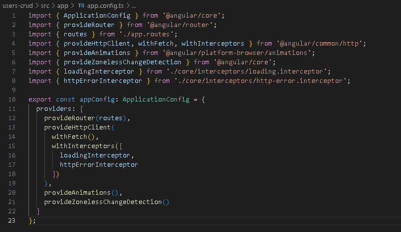
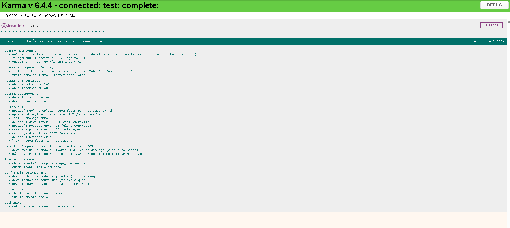
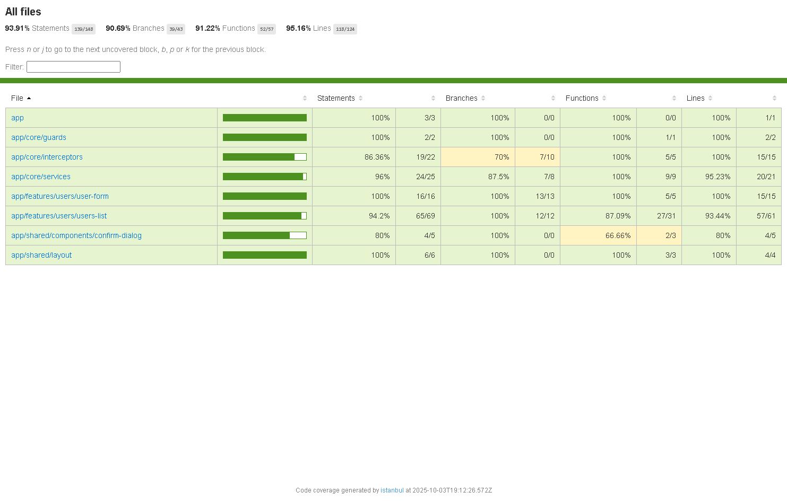
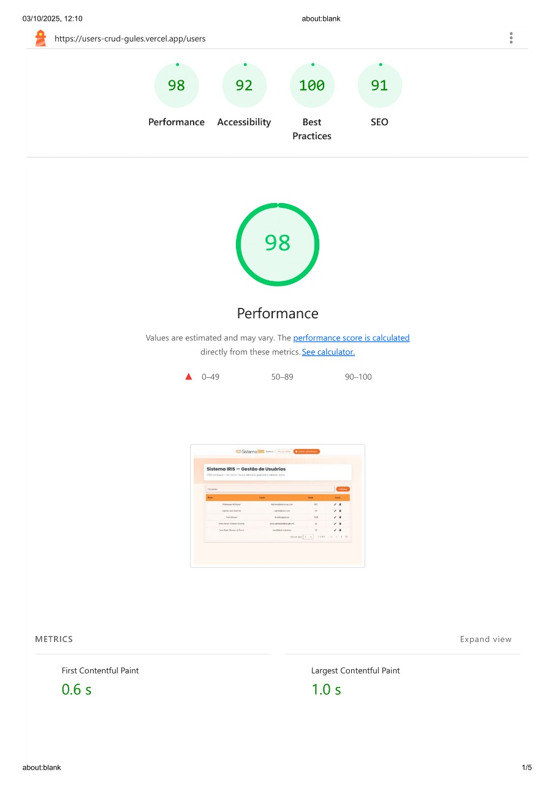
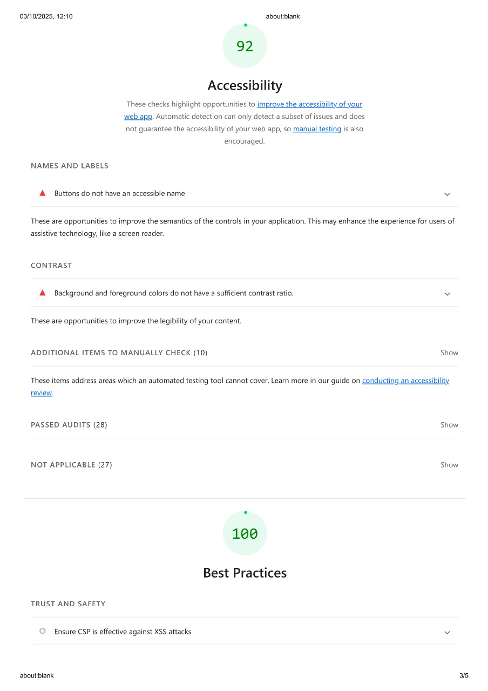

# 🎯 Sistema IRIS – Gestão de Usuários

Aplicação **Angular** para gestão de usuários (CRUD) desenvolvida para o desafio de **Desenvolvedor Front-End Angular**.


## 🔗 Links

* **Produção (Vercel)**: [https://users-crud-gules.vercel.app/users](https://users-crud-gules.vercel.app/users)
* **Repositório**: [https://github.com/Lucas-Christen/users-crud](https://github.com/Lucas-Christen/users-crud)

---

## 👀 Preview

<p align="center">
  
</p>
<p align="center">
  
</p>

---

## ✅ Requisitos do Desafio – Implementados

### 1) Listagem de Usuários

* Tabela com **Nome**, **E-mail**, **Idade** e **Ações**
* **Edição inline** por linha
* **Exclusão** com **modal de confirmação**
* **Busca** por nome/e-mail/idade
* **Paginação** (5/10/20) e **ordenação** por colunas

### 2) Formulário de Adição/Edição

* **Reactive Forms** com validações e mensagens de erro
* **Nome** obrigatório (min. 3)
* **E-mail** obrigatório (formato válido)
* **Idade** opcional (>= 18) com validador `minAgeOrNull`
* Botão **Salvar** desabilitado enquanto inválido
* Mesmo formulário serve para **criar** e **editar**

### 3) API REST

* **GET** `/users` • **POST** `/users` • **PUT** `/users/:id` • **DELETE** `/users/:id`
* Serviço dedicado **`UsersService`**
* Desenvolvimento com **proxy** (`/api` → json-server)
* Produção configurável via **env** + token (ver abaixo)

### 4) Validações e Feedback

* Erros exibidos por campo
* Loading global via interceptor + barra no topo
* Snackbar para mensagens de sucesso/erro

### 5) Organização e Boas Práticas

* Arquitetura **Core / Features / Shared**
* **Standalone Components** (Angular 20)
* **Interceptors** (loading & http-error)
* **Guard** preparado para autenticação
* Estilo com **SCSS** + **Angular Material**

---

## 🎁 Diferenciais

### Signals no layout (menu mobile)

`HeaderComponent` usa **Angular Signals** para o estado do menu mobile:

```ts
isMenuOpen = signal(false);
toggleMenu() { this.isMenuOpen.update(v => !v); }
```

Leitura direta no template (`isMenuOpen()`) e binding em classe `[class.menu-open]`, reduzindo boilerplate e funcionando muito bem com **zoneless**.

### Zoneless Change Detection

Ativado via `provideZonelessChangeDetection`.

<p></p>

### SSR habilitado

Build e serve **Server-Side Rendering**.

<p></p>

### Lazy Loading

Rotas com `loadComponent` (carga do UsersList sob demanda).

### Acessibilidade & Responsividade

ARIA/role/labels, tooltips, navegação por teclado e layout fluido para desktop/tablet/mobile.

---

## 🧪 Testes & Cobertura

* **80 testes passando**
* **Cobertura atual**:

  * **Statements:** 93.91% (135/144)
  * **Branches:** 90.69% (39/43)
  * **Functions:** 91.22% (52/57)
  * **Lines:** **95.16% (118/124)**

<p>
  
</p>
<p>
  
</p>

### Como rodar os testes

```bash
npm test
# ou com cobertura:
ng test --watch=false --code-coverage --browsers=ChromeHeadless
# relatório HTML: ./coverage/users-crud/index.html
```

---

## 🚀 Lighthouse & A11y

* **Performance** 98 • **Acessibilidade** 92 • **Best Practices** 100 • **SEO** 91

<p>
  
</p>
<p>
  
</p>

---

## 🏗️ Arquitetura

```
src/
├── app/
│   ├── core/
│   │   ├── guards/                 # authGuard
│   │   ├── interceptors/           # loading + http-error
│   │   ├── models/                 # interfaces (User)
│   │   ├── services/               # UsersService, LoadingService
│   │   └── tokens/                 # API_BASE_URL (InjectionToken)
│   ├── features/
│   │   └── users/
│   │       ├── user-form/          # Reactive form (add/edit)
│   │       └── users-list/         # Tabela, busca, paginação, ordenação
│   ├── shared/
│   │   ├── components/confirm-dialog
│   │   └── layout/                 # Header (Signals)
│   ├── app.component.ts
│   ├── app.config.ts               # Providers (interceptors, zoneless, router, http)
│   ├── app.routes.ts               # Rotas com lazy loading
│   └── material.imports.ts         # Imports do Angular Material
├── assets/
├── public/
├── styles.scss
├── theme.scss
└── vite-env.d.ts                   # Tipagem de import.meta.env
```

**Rotas (lazy):**

```ts
export const routes: Routes = [
  { path: '', pathMatch: 'full', redirectTo: 'users' },
  {
    path: 'users',
    loadComponent: () =>
      import('./features/users/users-list/users-list.component')
        .then(m => m.UsersListComponent),
    canActivate: [authGuard]
  },
  { path: '**', redirectTo: 'users' }
];
```

---

## 🌐 Configuração de API (dev/prod) — **compatível com SSR/Vite**

* O projeto usa um **InjectionToken** `API_BASE_URL` que lê a env **estaticamente** (`import.meta.env.NG_APP_API_BASE_URL`) e faz fallback para `'/api'` (proxy em dev).

**`src/app/core/tokens/api-base-url.token.ts` (resumo):**

```ts
export const API_BASE_URL = new InjectionToken<string>('API_BASE_URL', {
  providedIn: 'root',
  factory: () => import.meta.env.NG_APP_API_BASE_URL?.trim() || '/api'
});
```

**Tipagem do Vite** (arquivo já adicionado):

```ts
// vite-env.d.ts
/// <reference types="vite/client" />
interface ImportMetaEnv {
  readonly NG_APP_API_BASE_URL?: string;
}
interface ImportMeta {
  readonly env: ImportMetaEnv;
}
```

> ✅ Nunca use acesso dinâmico a `import.meta.env` (ex.: `const env = import.meta.env` ou `import.meta.env['X']`). Sempre **acesso estático**: `import.meta.env.NG_APP_API_BASE_URL`.

### Dev

* **API mock:** `json-server` em `http://localhost:3000`
* **Proxy:** requisições para `/api` são redirecionadas ao json-server

---

## 🔧 Como rodar

### Pré-requisitos

* **Node 18+**

### Instalação

```bash
git clone https://github.com/Lucas-Christen/users-crud
cd users-crud
npm install
```

### Desenvolvimento

```bash
# Terminal 1 – API mock (json-server)
npm run server   # http://localhost:3000

# Terminal 2 – App
npm start        # http://localhost:4200
```

### Dev (tudo junto)

```bash
npm run dev
```

### Produção (SSR local)

```bash
npm run ssr
# equivale a: npm run build:ssr && npm run serve:ssr
```

---

## 📱 API Endpoints (MockAPI / Dev)

```
GET    /users
POST   /users
PUT    /users/:id
DELETE /users/:id
```

**Modelo**

```ts
export interface User {
  id?: number | string;
  name: string;   // min 3
  email: string;  // formato válido
  age?: number;   // opcional, >= 18
}
```

---

## 🧭 Scripts úteis

```json
{
  "start": "ng serve",
  "server": "json-server --watch db.json --port 3000",
  "dev": "concurrently \"npm run server\" \"ng serve\"",
  "test": "ng test",
  "build": "ng build",
  "build:ssr": "ng build && ng run users-crud:server",
  "serve:ssr": "node dist/users-crud/server/server.mjs",
  "ssr": "npm run build:ssr && npm run serve:ssr"
}
```

---

## 👨‍💻 Autor

**Lucas Fernandes Christen**
📧 [lucaschristen@alunos.utfpr.edu.br](mailto:lucaschristen@alunos.utfpr.edu.br)

---

## 🏆 Destaques Técnicos

* Angular 20 (standalone), **Signals no layout**, **lazy loading**, **SSR**
* **Zoneless Change Detection** + Interceptors globais
* Reactive Forms com validadores customizados
* Tabela com filtro, paginação e ordenação
* Testes cobrindo service, componentes, guard e interceptors
  **Cobertura**: *Statements 93.91% • Branches 90.69% • Functions 91.22% • Lines 95.16%*
* UI responsiva e acessível (Material)

---

## 📎 Prints (diretório `docs/`)

* `preview-desktop.png` • `preview-mobile.png`
* `lighthouse-summary.png` • `a11y.png`
* `test-pass.png` • `coverage-summary.png`
* `ssr-view-source.png` • `zoneless-proof.png`

---